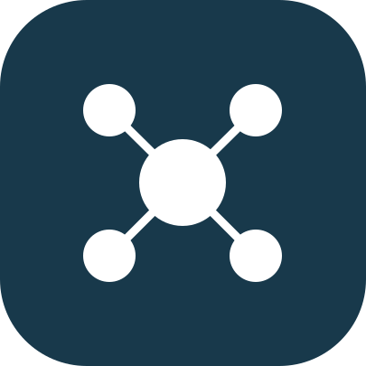
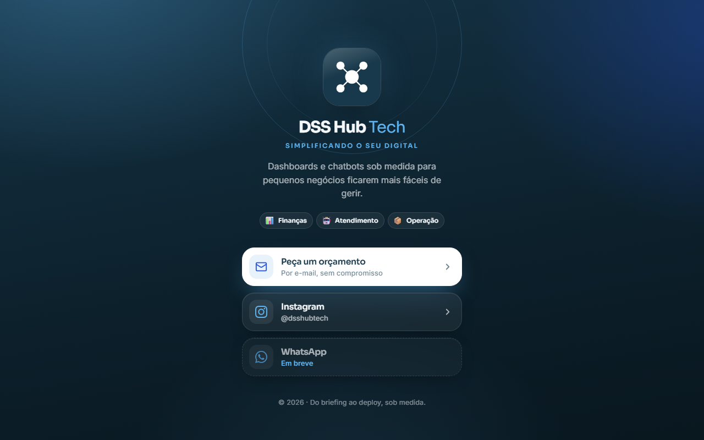

<div align="center">



# Link na bio · DSS Hub Tech

**Simplificando o seu digital.**

Página "link na bio" da DSS Hub Tech — dashboards e chatbots sob medida para pequenos negócios. Inclui o **Huby**, um chatbot com IA para o visitante testar na hora. Página leve, sem build, feita para abrir rápido no celular.

<br />

[](https://link-na-bio-dss.vercel.app)

<br />


</div>

<br />

## Sobre o projeto

A **DSS Hub Tech** é uma empresa de programação formada por três estudantes de Análise e Desenvolvimento de Sistemas, focada em **dashboards e chatbots sob medida** para pequenos negócios ficarem mais fáceis de gerir.

Esta página é o cartão de visitas digital da marca: um lugar único para o cliente **pedir um orçamento**, seguir no **Instagram** e, em breve, chamar no **WhatsApp**. O visual usa a identidade da empresa (azul-petróleo `#18394B`), cartões de vidro, tipografia profissional (**Sora** nos títulos e **Inter** nos textos) e ícones de bibliotecas abertas.

<br />

## Tela

<div align="center">



</div>

<br />

## Funcionalidades

- ✉️ **Orçamento por e-mail** — abre o e-mail já com o assunto preenchido.
- 📸 **Instagram** — atalho direto para o perfil da marca.
- 🤖 **Huby, o chatbot** — conversa curta, educada e bem-humorada que sempre convida para o orçamento (Gemini, com chave protegida no servidor, limite de uso e resposta curta).
- 💬 **WhatsApp** — marcado como "Em breve", pronto para ativar.
- 📊 **Áreas de atuação** — Finanças, Atendimento e Operação em chips.
- 🎞️ **Microinterações** — entrada escalonada, efeito ao tocar e foco visível, respeitando `prefers-reduced-motion`.
- 📱 **Mobile first** — alvos de toque grandes, sem rolagem lateral, com suporte à área segura do iOS.
- 🔎 **Compartilhamento** — meta tags, Open Graph e favicon com o símbolo da marca.

<br />

## Tecnologias

| Camada | Stack |
|--------|-------|
| **Marcação e estilo** | HTML5 · CSS3 (variáveis, `backdrop-filter`, animações) |
| **Comportamento** | JavaScript puro (links montados a partir de um `CONFIG`) |
| **Chatbot** | Função serverless na Vercel (`api/chat.js`) · Google Gemini (`gemini-flash-lite-latest`, tier grátis) |
| **Tipografia** | Sora (títulos) · Inter (textos) via Google Fonts |
| **Ícones** | [Lucide](https://lucide.dev/) · [Simple Icons](https://simpleicons.org/) |
| **Hospedagem** | Vercel (site estático) — [link-na-bio-dss.vercel.app](https://link-na-bio-dss.vercel.app) |

<br />

## Arquitetura

A página vive em um único `index.html`, sem etapa de build. O chatbot usa uma função serverless que guarda a chave da IA fora do navegador.

```
.
├── index.html          # página completa (HTML + CSS + JS + chat do Huby)
├── api/
│   └── chat.js         # função serverless: prompt do Huby + chamada ao Gemini
├── vercel.json
├── assets/
│   ├── simbolo.svg     # símbolo oficial da marca (favicon e topo)
│   └── prints/         # capturas usadas neste README
└── README.md
```

Os links ficam concentrados em um único objeto no fim do `index.html`:

```js
const CONFIG = {
  instagram: "dsshubtech",
  email: "contato@exemplo.com",
  emailSubject: "Quero conhecer a DSS Hub Tech"
};
```

<br />

## Como rodar localmente

```bash
# 1. Clone o repositório
git clone https://github.com/Danyyks/link-na-bio-dss.git
cd link-na-bio-dss

# 2. Sirva a pasta (qualquer servidor estático serve)
python -m http.server 5180
```

3. Abra `http://localhost:5180` no navegador. A página funciona, mas o chat precisa da função `/api/chat`.
4. Para testar o chat, crie uma chave grátis no [Google AI Studio](https://aistudio.google.com/apikey), guarde em `GEMINI_API_KEY` (arquivo `.env.local`, já ignorado pelo git) e rode `vercel dev`.
5. Edite o bloco `CONFIG` para trocar Instagram, e-mail e assunto.

<br />

## Roadmap

- [x] Publicar na Vercel.
- [x] Chatbot **Huby** com IA.
- [ ] Ativar o botão do **WhatsApp** quando houver número.
- [ ] Imagem de pré-visualização (Open Graph) para compartilhamento.
- [ ] Domínio próprio.

<br />

<div align="center">
<sub>Link na bio · página estática em HTML, CSS e JavaScript · design DSS Hub Tech</sub>
</div>
