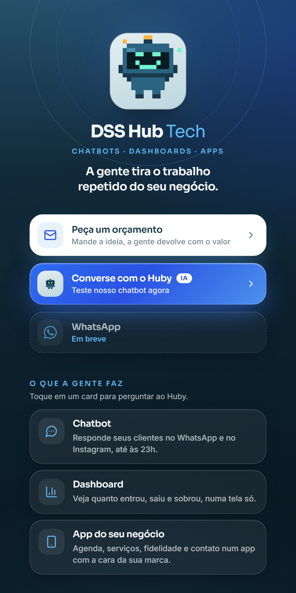
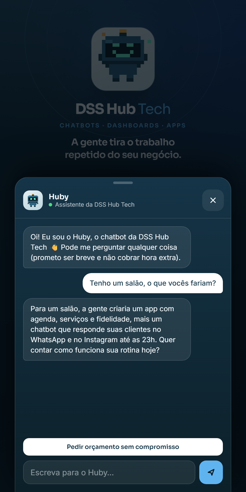

<div align="center">


# Link na bio · DSS Hub Tech

**A gente tira o trabalho repetido do seu negócio.**

Página "link na bio" da DSS Hub Tech. Reúne o pedido de orçamento, o Instagram e o Huby, nosso mascote robô, que também é um chatbot com IA para o visitante testar na hora. É uma página leve, sem etapa de build, feita para abrir rápido no celular.

<br />

[](https://dsshubtech.vercel.app)

<br />


</div>

<br />

## Sobre o projeto

A **DSS Hub Tech** é formada por Dany, Suellen e Simone, três amigos de Análise e Desenvolvimento de Sistemas em Sorocaba. A gente cria chatbots, dashboards e apps sob medida para quem atende, vende e empreende.

Esta página é o cartão de visitas digital da marca e o link que fica na bio do Instagram. Quem chega aqui pode pedir um orçamento, conversar com o Huby ou seguir a DSS. O visual segue a identidade da empresa: azul-petróleo `#18394B`, cartões de vidro, Sora nos títulos e Inter nos textos.

<br />

## Telas

<div align="center">

<table>
  <tr>
    <td align="center"><br /><sub><b>Página inicial</b></sub></td>
    <td align="center"><br /><sub><b>Conversa com o Huby</b></sub></td>
  </tr>
</table>

</div>

<br />

## O que tem na página

- **Huby no topo.** O mascote em pixel art (16 x 15 pixels) recebe o visitante na pose "Comemorando", com dois quadros alternados. Quem ativou "reduzir movimento" no celular vê o Huby parado.
- **Peça um orçamento.** Abre uma janela com três caminhos: escrever pelo Gmail, abrir o app de e-mail do aparelho ou copiar o endereço `dsshubtech@gmail.com`. Isso existe porque um link `mailto:` sozinho não faz nada em computador sem app de e-mail configurado nem no navegador interno do Instagram.
- **Converse com o Huby.** Chat com IA que responde em poucas frases e sempre termina com uma pergunta ou um próximo passo.
- **WhatsApp.** Marcado como "Em breve", pronto para ativar quando houver número.
- **O que a gente faz.** Três cards: Chatbot, Dashboard e App do seu negócio. Tocar em um deles abre o Huby com uma pergunta sobre aquele serviço.
- **Quem somos** e o atalho para o Instagram `@dsshubtech`.

<br />

## O Huby

O chat roda em uma função serverless na Vercel (`api/chat.js`) que chama o Google Gemini. A chave da IA fica só no servidor, e a função limita o tamanho das mensagens e a quantidade de pedidos por visitante.

As instruções do Huby ficam no próprio `api/chat.js`. As regras principais:

- Nunca fala de valores, preços, mensalidades ou taxas. Se alguém pergunta quanto custa, ele explica que a equipe monta um orçamento a partir da ideia do cliente e já envia o valor junto.
- Não inventa prazos, clientes, números ou funcionalidades.
- Sabe que a DSS lança um app modelo por nicho, um de cada vez, começando por beleza e nail design, que ainda está em construção.
- Atende negócios de qualquer tamanho em Sorocaba e região.
- Não pede nem aceita dados sensíveis.

<br />

## Tecnologias

| Camada | Stack |
|--------|-------|
| **Marcação e estilo** | HTML5 e CSS3 (variáveis, `backdrop-filter`, animações, `<dialog>`) |
| **Comportamento** | JavaScript puro, com os contatos concentrados em um objeto `CONFIG` |
| **Mascote** | SVG gerado no navegador a partir da grade de pixels do Huby |
| **Chatbot** | Função serverless na Vercel (`api/chat.js`) com Google Gemini |
| **Tipografia** | Sora (títulos) e Inter (textos) via Google Fonts |
| **Ícones** | [Lucide](https://lucide.dev/) e [Simple Icons](https://simpleicons.org/) |
| **Hospedagem** | Vercel, em [dsshubtech.vercel.app](https://dsshubtech.vercel.app) |

<br />

## Estrutura

A página inteira vive em um único `index.html`. O chat usa uma função serverless para manter a chave da IA fora do navegador.

```
.
├── index.html          # página completa (HTML, CSS, JS, Huby e janela de orçamento)
├── api/
│   └── chat.js         # função serverless: instruções do Huby e chamada ao Gemini
├── vercel.json
├── assets/
│   ├── simbolo.svg     # símbolo oficial da marca (favicon)
│   ├── og.png          # prévia ao compartilhar o link
│   ├── apple-touch-icon.png · icon-192.png
│   └── prints/         # capturas usadas neste README
└── README.md
```

Os contatos ficam em um único objeto perto do fim do `index.html`:

```js
const CONFIG = {
  instagram: "dsshubtech",
  email: "dsshubtech@gmail.com",
  emailSubject: "Quero conhecer a DSS Hub Tech"
};
```

<br />

## Como rodar localmente

```bash
# 1. Clone o repositório
git clone https://github.com/Danyyks/link-na-bio-dss.git
cd link-na-bio-dss

# 2. Sirva a pasta (qualquer servidor estático serve)
python -m http.server 5180
```

3. Abra `http://localhost:5180` no navegador. A página funciona, mas o chat precisa da função `/api/chat`.
4. Para testar o chat, crie uma chave grátis no [Google AI Studio](https://aistudio.google.com/apikey), guarde em `GEMINI_API_KEY` no arquivo `.env.local` (já ignorado pelo git) e rode `vercel dev`.
5. Para trocar Instagram, e-mail ou assunto, edite o bloco `CONFIG`.

<br />

## Próximos passos

- [x] Publicar na Vercel.
- [x] Chatbot Huby com IA.
- [x] Huby em pixel art na página.
- [x] Endereço `dsshubtech.vercel.app`.
- [x] Pedido de orçamento que funciona sem app de e-mail.
- [ ] Ativar o botão do WhatsApp quando houver número.
- [ ] Domínio próprio.

<br />

<div align="center">
<sub>Link na bio da DSS Hub Tech · HTML, CSS e JavaScript · do briefing ao deploy, sob medida</sub>
</div>
